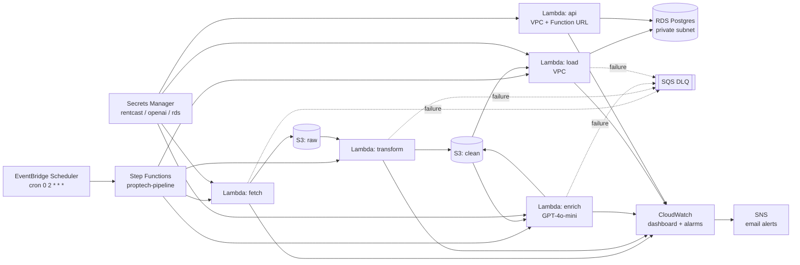

# Architecture

> Source diagram. Export PNG to `docs/architecture.png` via excalidraw.com or draw.io.

## Components

- **EventBridge Scheduler** — nightly trigger 02:00 UTC.
- **Step Functions** — orchestrates fetch → transform → enrich → load with retries.
- **fetch Lambda** — RentCast API → S3 raw bucket.
- **transform Lambda** — S3 raw → S3 clean (normalize fields).
- **enrich Lambda** — S3 clean → S3 clean (GPT-4o-mini distress score).
- **load Lambda** — S3 clean → RDS Postgres (in VPC).
- **api Lambda** — RDS → JSON via Lambda Function URL.
- **SQS DLQ** — captures Lambda failures.
- **CloudWatch dashboard + SNS alarms** — observability + email on errors.
- **Secrets Manager** — RentCast key, OpenAI key, RDS credentials.

## VPC Boundary

Only `load` and `api` Lambdas attach to VPC (RDS access). `fetch`, `transform`, `enrich` run outside VPC to avoid NAT Gateway cost.
